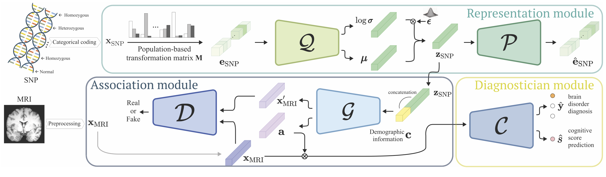

## ENGINE: Enhancing Neuroimaging and Genetic Information by Neural Embedding
<p align="center"></p>

This repository provides a TensorFlow implementation of the following paper:
> **ENGINE: Enhancing Neuroimaging and Genetic Information by Neural Embedding**<br>
> [Wonjun Ko](https://scholar.google.com/citations?user=Fvzg1_sAAAAJ&hl=ko&oi=ao)<sup>1</sup>, [Wonsik Jung](https://scholar.google.co.kr/citations?user=W4y-TAcAAAAJ&hl=ko)<sup>1</sup>, [Eunjin Jeon](https://scholar.google.com/citations?user=U_hg5B0AAAAJ&hl=ko)<sup>1</sup>, [Ahmad Wisnu Mulyadi](https://scholar.google.co.kr/citations?user=u50w0cUAAAAJ&hl=ko)<sup>1</sup>, and [Heung-Il Suk](https://scholar.google.co.kr/citations?user=dl_oZLwAAAAJ&hl=ko)<sup>1, 2</sup><br/>
> (<sup>1</sup>Department of Brain and Cognitive Engineering, Korea University) <br/>
> (<sup>1</sup>Department of Artificial Intelligence, Korea University) <br/>
> Official Version: https://ieeexplore.ieee.org/abstract/document/9679140 <br/>
> Presented in the 21st IEEE International Conference on Data Mining (ICDM2021 Acceptance rate: 20%)
> 
> **Abstract:** *Recently, deep learning, a branch of machine learning and data mining, has gained widespread acceptance in many applications thanks to its unprecedented successes. In this regard, pioneering studies employed deep learning frameworks for imaging genetics in virtue of their own representation caliber. But,existing approaches suffer from some limitations: (i) exploiting a simple concatenation strategy for joint analysis, (ii) a lack of extension to biomedical applications, and (iii) insufficient and inappropriate interpretations in the viewpoint of both data science and bio-neuroscience. In this work, we propose a novel deep learning framework to tackle the aforementioned issues simultaneously. Our proposed framework learns to effectively represent the neuroimaging and the genetic data jointly, and achieves state-of-the-art performance in its use for Alzheimer’s disease and mild cognitive impairment identification. Further, unlike the existing methods in the literature, the framework allows learning the relation between imaging phenotypes and genotypes in a nonlinear way without any prior neuroscientific knowledge. To demonstrate the validity of our proposed framework, we conducted experiments on a publicly available dataset and analyzed the results from diverse perspectives. Based on our experimental results, we believe that the proposed framework has a great potential to give new insights and perspectives in deep learning-based imaging genetics studies.*

and

> **A Deep Generative–Discriminative Learning for Multi-modal Representation in Imaging Genetics**<br>
> [Wonjun Ko](https://scholar.google.com/citations?user=Fvzg1_sAAAAJ&hl=ko&oi=ao)<sup>1</sup>, [Wonsik Jung](https://scholar.google.co.kr/citations?user=W4y-TAcAAAAJ&hl=ko)<sup>1</sup>, [Eunjin Jeon](https://scholar.google.com/citations?user=U_hg5B0AAAAJ&hl=ko)<sup>1</sup>, and [Heung-Il Suk](https://scholar.google.co.kr/citations?user=dl_oZLwAAAAJ&hl=ko)<sup>1, 2</sup><br/>
> (<sup>1</sup>Department of Brain and Cognitive Engineering, Korea University) <br/>
> (<sup>1</sup>Department of Artificial Intelligence, Korea University) <br/>
> Official Version: https://ieeexplore.ieee.org/document/9743914 <br/>
> Published in IEEE Transactions on Medical Imaging (2020 JCR-IF: 10.048, Radiology-Nuclear Medicine & Medical Imaging: 4/133)
> 
> **Abstract:** *Imaging genetics, one of the foremost emerging topics in the medical imaging field, analyzes the inherent relations between neuroimaging and genetic data. As deep learning has gained widespread acceptance in many applications, pioneering studies employed deep learning frameworks for imaging genetics. However, existing approaches suffer from some limitations. First, they often adopt a simple strategy for joint learning of phenotypic and genotypic features. Second, their findings have not been extended to biomedical applications, e.g., degenerative brain disease diagnosis and cognitive score prediction. Finally, existing studies perform insufficient and inappropriate analyses from the perspective of data science and neuroscience. In this work, we propose a novel deep learning framework to simultaneously tackle the aforementioned issues. Our proposed framework learns to effectively represent the neuroimaging and the genetic data jointly, and achieves state-of-the-art performance when used for Alzheimer's disease and mild cognitive impairment identification. Furthermore, unlike the existing methods, the framework enables learning the relation between imaging phenotypes and genotypes in a nonlinear way without any prior neuroscientific knowledge. To demonstrate the validity of our proposed framework, we conducted experiments on a publicly available dataset and analyzed the results from diverse perspectives. Based on our experimental results, we believe that the proposed framework has immense potential to provide new insights and perspectives in deep learning-based imaging genetics studies.*

## Dependencies
* [Python 3.6+](https://www.continuum.io/downloads)
* [TensorFlow 2.2.0+](https://www.tensorflow.org/)

## Downloading datasets
To download Alzheimer's disease neuroimaging initiative dataset
* http://www.loni.usc.edu/ADNI

To download AlzGene database
* http://www.alzgene.org

## Usage
`engine.py` contains the proposed deep learning architectures, `utils.py` contains functions used for experimental procedures, and `engine_experiment.py` contains the main experimental functions.

## Citation
If you find this work useful for your research, please cite our [conference proceeding](https://ieeexplore.ieee.org/abstract/document/9679140):
```
@inproceedings{ko2021engine,
  title={ENGINE: Enhancing Neuroimaging and Genetic Information by Neural Embedding},
  author={Ko, Wonjun and Jung, Wonsik and Jeon, Eunjin and Mulyadi, Ahmad Wisnu and Suk, Heung-Il},
  booktitle={2021 IEEE International Conference on Data Mining (ICDM)},
  pages={1162--1167},
  year={2021},
  organization={IEEE}
}
```

and our journal publication:
```
TBA
```

## Acknowledgements
This work was supported by National Research Foundation of Korea (NRF) grant (No. 2019R1A2C1006543) and Institute for Information & Communications Technology Promotion (IITP) grant (No. 2019-0-00079; Department of Artificial Intelligence, Korea University) funded by the Korea government.
